# 🚀 Axios Network Manager

A highly customizable, robust, and production-ready HTTP request client wrapper built on top of **Axios** and **TypeScript**. 

It handles complex network communication flows out-of-the-box, making it ideal for both client-side (React, Vue, etc.) and server-side (Node.js) applications.

---

## ✨ Features

- **🔒 Auto Refresh Token Interceptor**: Gracefully intercept `401 Unauthorized` responses, perform a `/refresh-token` handshake, and retry the original request with the fresh token.
- **⏳ Request Queueing**: While a token refresh is in progress, subsequent requests are automatically queued and resolved once the new token is acquired.
- **🔁 Intelligent Auto-Retry**: Automatically retries failed requests on transient network or server errors (`408`, `429`, `500`, `502`, `503`, `504`) with exponential backoff and randomized jitter.
- **📄 Descriptive Error Mapping**: Maps standard HTTP statuses into clean, typed classes (`AuthError`, `TimeoutError`, `NetworkError`) for easy error handling.
- **📊 Rich Terminal Logging**: Pretty-printed logs for request methods, URLs, query parameters, payloads, response times, and statuses.
- **📦 Zero Browser/Node Bloat**: Standard TS/JS code with Axios as the only core dependency.

---

## 📂 Directory Structure

```text
network-manager/
├── index.ts                 # Package entry point
├── network.manager.ts       # Main NetworkManager class
├── token.store.ts           # Token storage manager (Memory + LocalStorage/Custom)
├── types.ts                 # TypeScript interfaces and Error classes
└── interceptors/            # Modular interceptors
    ├── auth.interceptor.ts  # Token authorization & auto-refresh
    ├── error.interceptor.ts # HTTP Status to custom Error mapper
    ├── logger.interceptor.ts# Beautiful logs
    └── retry.interceptor.ts # Transient error auto-retry
```

---

## 🔧 Installation & Dependencies

Ensure your project has `axios` installed:

```bash
pnpm add axios
# or
npm install axios
```

---

## 💻 Usage Guide

### 1. Frontend Integration (Vue, React, etc.)

In browser environments, the manager can utilize the built-in `localStorage` for persisting sessions.

```typescript
import { NetworkManager } from "./network-manager";

// Instantiate the Network Manager
const api = new NetworkManager({
    baseURL: "https://api.yourdomain.com/v1",
    timeout: 10000,
    refreshEndpoint: "/auth/refresh-token",
    maxRetries: 3,
    retryDelay: 1000,
    enableLogging: true,

    // Triggered if refresh token is expired/invalid and user must log in again
    onAuthFailure: () => {
        console.error("🔐 Session expired! Redirecting to login...");
        window.location.href = "/login";
    },

    // Triggered upon successful token renewal
    onTokenRefreshed: (tokens) => {
        console.log("✅ Token successfully renewed!");
        localStorage.setItem("my_access_token", tokens.accessToken);
    },
});

// Configure tokens on successful login
api.setTokens({
    accessToken: "your_initial_access_token",
    refreshToken: "your_initial_refresh_token"
});

// Perform type-safe requests
interface UserInfo {
    id: string;
    name: string;
    email: string;
}

async function fetchProfile() {
    try {
        const profile = await api.get<UserInfo>("/auth/me");
        console.log("User Profile:", profile.name);
    } catch (error) {
        if (error instanceof AuthError) {
            // Handled automatically, but you can add custom logic here
        }
    }
}
```

---

### 2. Backend / Node.js Integration

In Node.js projects, global objects like `window` or `localStorage` are not available. To adapt `NetworkManager` for Node.js, you simply need to modify `token.store.ts` to use a custom adapter (e.g. Memory, Redis, or a local file).

#### Customizing `token.store.ts` for Node.js:
Replace the `localStorage` dependencies in `token.store.ts` with memory-only fallback or a custom storage layer:

```typescript
// token.store.ts (NodeJS Compatible Version)
import type { TokenPair } from "./types";

class TokenStore {
    private _accessToken: string | null = null;
    private _refreshToken: string | null = null;
    private _expiresAt: number | null = null;

    get accessToken(): string | null {
        return this._accessToken;
    }

    get refreshToken(): string | null {
        return this._refreshToken;
    }

    get isExpired(): boolean {
        if (!this._expiresAt) return false;
        return Date.now() >= this._expiresAt;
    }

    setTokens(tokens: TokenPair, expiresIn?: number): void {
        this._accessToken = tokens.accessToken;
        if (tokens.refreshToken) {
            this._refreshToken = tokens.refreshToken;
        }
        if (expiresIn) {
            this._expiresAt = Date.now() + (expiresIn - 10) * 1000;
        }
    }

    clear(): void {
        this._accessToken = null;
        this._refreshToken = null;
        this._expiresAt = null;
    }
}

export const tokenStore = new TokenStore();
```

#### Node.js Server Usage:
```typescript
import { NetworkManager } from "./network-manager";

const backendClient = new NetworkManager({
    baseURL: "http://localhost:5050/api/v1",
    enableLogging: true,
    refreshEndpoint: "/auth/refresh-token"
});

// Setting tokens for server-to-server operations
backendClient.setTokens({
    accessToken: "server_access_token",
    refreshToken: "server_refresh_token"
});
```

---

### 3. Production Client Setup Example

Here is a practical, production-ready instantiation example showing custom auth failures, log redirection, dynamic token refresh management, and modular paths imports:

```typescript
import { NetworkManager } from "./network-manager";


const client = new NetworkManager({
    baseURL: 'https://example_api_base_url',
    timeout: 10_000,
    refreshEndpoint: '/example_refresh_token_endpoint',
    maxRetries: 3,
    retryDelay: 1_000,
    enableLogging: true,

    onAuthFailure: () => {
        console.error("🔐 Session expired! Redirecting to login page...");
        // Example actions for client-side router:
        // window.location.href = "/auth/login";
        // router.push("/auth/login");
        // localStorage.removeItem(accessTokenTitle);
        // localStorage.clear();
    },

    onTokenRefreshed: (tokens) => {
        console.log("✅ Token successfully renewed:", tokens.accessToken.slice(0, 20) + "...");
        // Save new access token to client storage
        localStorage.setItem(accessTokenTitle, tokens.accessToken);
    },
});

export default client;
```

---

## ⚙️ Configuration Options (`NetworkManagerConfig`)

When instantiating `NetworkManager`, you can pass the following configuration:

| Property | Type | Default | Description |
| :--- | :--- | :--- | :--- |
| `baseURL` | `string` | **Required** | The primary URL endpoint of your API. |
| `timeout` | `number` | `10000` | Request timeout limit in milliseconds. |
| `defaultHeaders` | `Record<string, string>` | `undefined` | Custom request headers applied to all requests. |
| `refreshEndpoint` | `string` | `"/auth/refresh"` | The endpoint for renewing access tokens. |
| `maxRetries` | `number` | `3` | Maximum retry attempts for transient server errors. |
| `retryDelay` | `number` | `1000` | Base retry delay in milliseconds. |
| `retryStatusCodes`| `number[]` | `[408, 429, 500, 502, 503, 504]` | HTTP status codes that trigger a retry. |
| `enableLogging` | `boolean` | `false` | Enable or disable rich console logs. |
| `onAuthFailure` | `() => void` | `undefined` | Callback function triggered when login/refresh completely fails. |
| `onTokenRefreshed`| `(tokens: TokenPair) => void` | `undefined` | Callback function triggered on successful token renewal. |

---

## 📚 API Reference

### 1. `NetworkManager` Methods

#### `setTokens(tokens: TokenPair, expiresIn?: number): void`
Manually registers or updates the `accessToken` and optional `refreshToken` in memory and local storage.
- **`tokens`**: Object carrying `{ accessToken: string; refreshToken?: string }`.
- **`expiresIn`** *(optional)*: Expiry offset in seconds to determine expiration timing.

#### `clearTokens(): void`
Completely logs out the user session locally by erasing all tokens and expiry values.

#### `getAccessToken(): string | null`
Returns the active raw bearer access token value, or `null` if unauthenticated.

#### `get<T = unknown>(url: string, config?: AxiosRequestConfig): Promise<T>`
Type-safe wrapper for HTTP `GET` requests. Returns the direct `response.data` body.
- **`url`**: The endpoint path relative to `baseURL` (e.g. `"/users"`).
- **`config`** *(optional)*: Additional Axios request configuration object.

#### `post<T = unknown>(url: string, data?: unknown, config?: AxiosRequestConfig): Promise<T>`
Type-safe wrapper for HTTP `POST` requests. Returns the direct `response.data` body.

#### `put<T = unknown>(url: string, data?: unknown, config?: AxiosRequestConfig): Promise<T>`
Type-safe wrapper for HTTP `PUT` requests. Returns the direct `response.data` body.

#### `patch<T = unknown>(url: string, data?: unknown, config?: AxiosRequestConfig): Promise<T>`
Type-safe wrapper for HTTP `PATCH` requests. Returns the direct `response.data` body.

#### `delete<T = unknown>(url: string, config?: AxiosRequestConfig): Promise<T>`
Type-safe wrapper for HTTP `DELETE` requests. Returns the direct `response.data` body.

#### `get axiosInstance(): AxiosInstance`
Exposes the underlying raw Axios client instance in case you need to mount custom plugins or interceptors directly.

---

### 2. Custom Error Classes

All unsuccessful API responses are automatically caught by the error mapping layer and thrown as specific typed exceptions extending from the base `NetworkError` class.

```typescript
// 1. Base Network Error
class NetworkError extends Error {
    readonly statusCode?: number;  // HTTP Response status code (e.g. 403, 404, 500)
    readonly response?: unknown;    // Server response body payload
}

// 2. 401 Unauthorized Error (Thrown on complete session failure)
class AuthError extends NetworkError {}

// 3. Request timeout error (Code ECONNABORTED / ETIMEDOUT)
class TimeoutError extends NetworkError {}
```

---

### 3. Model Interfaces

#### `TokenPair`
```typescript
interface TokenPair {
    accessToken: string;
    refreshToken?: string;
}
```

#### `RefreshTokenResponse`
```typescript
interface RefreshTokenResponse {
    success: boolean;
    message?: string;
    errorCode?: string | number;
    body: {
        accessToken: string;
        refreshToken?: string;
        expireIn?: number;
    };
}
```

---

## 🔄 Refresh Token Handshake Flow

Here is how the interceptor handles `401 Unauthorized` requests under the hood:

```mermaid
sequenceDiagram
    autonumber
    participant Client as Application Request
    participant Manager as NetworkManager Interceptors
    participant Server as API Server

    Client->>Manager: GET /auth/me
    Manager->>Server: Send Request (Expired Token)
    Server-->>Manager: 401 Unauthorized Response
    Note over Manager: Auth Response Interceptor catches 401
    
    rect rgb(40, 50, 70)
        Note over Manager: Start Refresh Flow (Queue active)
        Manager->>Server: POST /auth/refresh-token (Refresh Request)
        Server-->>Manager: 200 OK (New Access Token)
        Note over Manager: Save new token to TokenStore
    end
    
    Manager->>Server: GET /auth/me (Retried with NEW Token)
    Server-->>Manager: 200 OK Response
    Manager-->>Client: Resolve original request with data
```



---

## 🛡️ License

This package is open-source and free to be included in any private or public Node.js/web projects. Enjoy!
